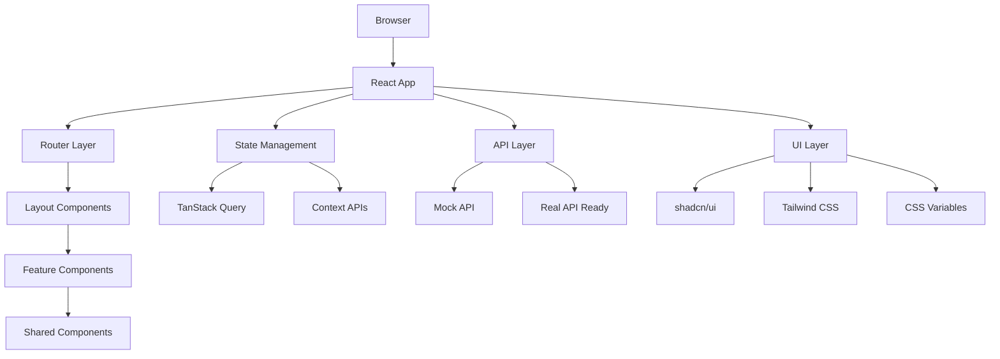

# myCistern IoT Device Management Platform

A modern, full-featured React + TypeScript application for comprehensive IoT device management with real-time monitoring, device control, and multi-language support.

## 🚀 Features

### Core Functionality
- ✅ **Real-time Device Monitoring** - Live dashboard with device status and metrics
- ✅ **Device Search & Filtering** - Powerful search with voice input support
- ✅ **Device Control** - Send commands and update configurations remotely
- ✅ **Live Metrics Polling** - Real-time telemetry data with automatic updates
- ✅ **Responsive Design** - Mobile-first design that works on all devices

### Technical Stack
- ✅ **React 18** with TypeScript for type-safe development
- ✅ **Vite** for lightning-fast development and building
- ✅ **React Router v7** with modern routing patterns
- ✅ **TanStack Query** (React Query) for advanced data fetching
- ✅ **shadcn/ui + Tailwind CSS** for modern, accessible UI components
- ✅ **i18next** for internationalization (English/German support)

### User Experience
- ✅ **Dark/Light Theme** with system preference detection
- ✅ **Multi-language Support** (English/German) with full translation
- ✅ **GDPR Cookie Compliance** with granular preferences
- ✅ **Toast Notifications** for user feedback
- ✅ **Error Boundaries** with graceful error handling
- ✅ **Loading States** with skeleton components

## 📁 Project Structure

```
src/
├── api/
│   ├── client.ts                    # Unified API client with mock/real switching
│   └── mockApi.ts                   # Mock data and API responses
├── app/
│   ├── AppLayout.tsx               # Main layout with navigation & footer
│   ├── AppLayout.css
│   ├── Home.tsx                    # Landing page with hero & features
│   └── Home.css
├── components/ui/                   # shadcn/ui component library
│   ├── button.tsx                  # Button component with variants
│   ├── card.tsx                    # Card layout components
│   ├── badge.tsx                   # Status badges
│   ├── input.tsx                   # Form input components
│   ├── switch.tsx                  # Toggle switches
│   └── toast.tsx                   # Toast notification system
├── context/
│   └── ThemeContext.tsx            # Theme and language management
├── features/
│   └── devices/
│       ├── DeviceList.tsx          # Device grid with search & filters
│       ├── DeviceList.css
│       ├── DeviceDetail.tsx        # Detailed device dashboard
│       └── DeviceDetail.css
├── hooks/
│   ├── useCookieConsent.ts        # Cookie consent management
│   └── use-toast.ts               # Toast notification hook
├── i18n/
│   └── config.ts                  # Internationalization configuration
├── pages/
│   └── CookiePolicy.tsx           # GDPR cookie policy page
├── shared/
│   └── components/
│       ├── CookieBanner.tsx       # GDPR cookie consent banner
│       ├── CookiePreferences.tsx  # Cookie preferences modal
│       ├── ThemeToggle.tsx        # Theme & language toggle buttons
│       ├── LoadingSpinner.tsx     # Loading state component
│       └── ErrorDisplay.tsx       # Error state component
├── App.tsx                        # Router setup with providers
├── main.tsx                       # Application entry point
├── globals.css                    # Global styles and CSS variables
└── vite-env.d.ts                 # TypeScript declarations
```

## 🚀 Getting Started

### Prerequisites

- **Node.js** (v18 or higher) - [Download here](https://nodejs.org/)
- **pnpm** (recommended) - Install with `npm install -g pnpm`
- Modern web browser with JavaScript enabled

### Quick Start

1. **Clone the repository**
   ```bash
   git clone https://github.com/GaneshMandakapu/myCistern-TrialWorkday.git
   cd myCistern-TrialWorkday
   ```

2. **Install dependencies**
   ```bash
   pnpm install
   ```

3. **Start development server**
   ```bash
   pnpm dev
   ```

4. **Open your browser**
   - Navigate to `http://localhost:5173` (or `http://localhost:5174` if 5173 is in use)
   - The application will automatically reload when you make changes

### Available Scripts

```bash
pnpm dev          # Start development server with HMR
pnpm build        # Build for production
pnpm preview      # Preview production build locally
pnpm lint         # Run ESLint
pnpm type-check   # Run TypeScript compiler check
```

### Application Routes

| Route | Description | Features |
|-------|-------------|----------|
| `/` | **Home Page** | Hero section, features overview, team site link |
| `/devices` | **Device List** | Search, filter, device grid with status |
| `/devices/:id` | **Device Detail** | Live metrics, device control, status monitoring |
| `/cookies` | **Cookie Policy** | GDPR compliance information |

## 🏗️ Architecture Overview

### Frontend Architecture

The application follows a **feature-based modular architecture** with clear separation of concerns:



### Key Design Patterns

1. **Container/Presentational Pattern** - Smart containers handle logic, dumb components handle UI
2. **Custom Hooks Pattern** - Reusable logic in hooks (useDevices, useCookieConsent, etc.)
3. **Compound Component Pattern** - Complex UI components built from smaller, focused components
4. **Provider Pattern** - Context providers for global state (theme, language, query client)
5. **Error Boundary Pattern** - Graceful error handling with fallback UI

### Data Flow

```
User Interaction → Component → Custom Hook → TanStack Query → API Client → Mock/Real API
                                     ↓
User Interface ← Component ← State Update ← Cache Update ← API Response
```

## 🔧 Configuration & Environment

### Environment Variables

The app supports environment-based configuration via `.env` files:

```bash
# API Configuration
VITE_USE_MOCK_API=true              # Toggle between mock and real API
VITE_API_BASE_URL=http://localhost:3001  # Real API base URL (when implemented)

# Feature Flags
VITE_ENABLE_VOICE_SEARCH=true      # Enable/disable voice search feature
VITE_POLLING_INTERVAL=5000         # Metrics polling interval (ms)
```

### Build Configuration

- **Vite** for fast development and optimized production builds
- **TypeScript** for type safety and better developer experience
- **PostCSS** with Tailwind CSS for styling
- **ESLint + Prettier** for code quality and formatting

## 🎯 Design Assumptions

### Technical Assumptions
- **Modern Browser Support** - Assumes ES2020+ support (Chrome 80+, Firefox 72+, Safari 13+)
- **JavaScript Enabled** - Application requires JavaScript to function
- **Internet Connection** - Required for external links and future real API integration
- **Local Storage Available** - Used for theme preferences and cookie consent storage

### Business Logic Assumptions
- **Device Types** - Supports common IoT device categories (sensors, controllers, gateways)
- **Status States** - Devices can be 'online', 'offline', or 'unknown'
- **Metrics Format** - Assumes numeric telemetry data (temperature, humidity, pressure, etc.)
- **User Roles** - Single user role with full device management permissions
- **Real-time Updates** - Polling-based updates (5-second intervals) rather than WebSocket connections

### Data Assumptions
- **Device IDs** - Unique string identifiers for each device
- **Timestamp Format** - ISO 8601 datetime strings for all time-related data
- **Metric Units** - Celsius for temperature, percentage for humidity/battery
- **Location Format** - Human-readable location strings (not GPS coordinates)

### UI/UX Assumptions
- **Responsive Design** - Mobile-first approach targeting phones, tablets, and desktops
- **Accessibility** - WCAG 2.1 AA compliance targeted
- **Language Support** - Currently supports English and German
- **Theme Preference** - Users can choose between light/dark modes

## ⚠️ Known Limitations

### Current Limitations

1. **Mock API Only**
   - Currently uses simulated data only
   - No persistence between sessions
   - Limited to predefined device scenarios

2. **Authentication**
   - No user authentication system implemented
   - No role-based access control
   - Single-user application mode only

3. **Real-time Communication**
   - Uses polling instead of WebSockets
   - 5-second update intervals may miss rapid changes
   - No push notifications for critical alerts

4. **Data Persistence**
   - No backend database integration
   - Settings stored in browser localStorage only
   - No data synchronization across devices

5. **Mobile App Features**
   - Web-based only, no native mobile app
   - Limited offline functionality
   - No device-specific notifications

### Performance Considerations

- **Large Device Lists** - Performance may degrade with 1000+ devices
- **Memory Usage** - Metrics data accumulates during long sessions
- **Network Requests** - Polling can increase bandwidth usage
- **Bundle Size** - Full component library included (not tree-shaken)

### Browser Compatibility

- **Internet Explorer** - Not supported
- **Legacy Browsers** - Requires modern JavaScript features
- **Mobile Browsers** - Optimized for mobile Safari and Chrome
- **Offline Mode** - Limited functionality without internet connection

## 📊 API Documentation

All API functions are available in `src/api/client.ts`:

### Device Management
- `getDevices(query?, page?)` - Get all devices with optional search and pagination
- `getDeviceDetails(deviceId)` - Get detailed information for a specific device  
- `getDeviceMetrics(deviceId)` - Get metrics/telemetry data for a device
- `postDeviceCommand(command)` - Send a command to a device

### TypeScript Interfaces

```typescript
// Core device interface
interface Device {
  id: string;
  name: string;
  status: 'online' | 'offline' | 'unknown';
  type: 'sensor' | 'controller' | 'gateway' | 'actuator';
  location: string;
  lastSeen: string;
  batteryLevel?: number;
}

// Extended device information
interface DeviceDetails extends Device {
  firmwareVersion: string;
  ipAddress: string;
  macAddress: string;
  uptime: number;
  description: string;
  manufacturer: string;
  model: string;
  serialNumber: string;
}

// Real-time metrics data
interface DeviceMetrics {
  deviceId: string;
  timestamp: string;
  temperature?: number;      // Celsius
  humidity?: number;         // Percentage
  pressure?: number;         // hPa
  batteryLevel?: number;     // Percentage
  signalStrength?: number;   // dBm
  cpuUsage?: number;         // Percentage
  memoryUsage?: number;      // Percentage
}

// Device command interface
interface DeviceCommand {
  deviceId: string;
  command: 'restart' | 'update_firmware' | 'set_config' | 'calibrate';
  parameters?: Record<string, unknown>;
  timestamp: string;
  userId?: string;
}

// API response wrapper
interface ApiResponse<T> {
  data: T;
  success: boolean;
  message?: string;
  timestamp: string;
}

// Pagination interface
interface PaginatedResponse<T> {
  items: T[];
  totalCount: number;
  page: number;
  pageSize: number;
  hasNextPage: boolean;
}
```

## 📸 Screenshots

### Home Page - Light Theme

*Modern landing page with gradient hero section and feature cards*

### Home Page - Dark Theme  

*Dark theme with consistent branding and improved readability*

### Device List - Desktop

*Responsive device grid with search functionality and status badges*

### Device Detail - Live Metrics

*Real-time device dashboard with live metrics and control options*

### Mobile Responsive Design

*Mobile-optimized layout with touch-friendly navigation*

### Multi-language Support

*Complete German localization with proper typography*

### Cookie Consent & GDPR Compliance

*GDPR-compliant cookie consent with granular preferences*

> **Note:** Screenshots show the application running with mock data. The UI is fully functional and responsive across all screen sizes.

## 🛠️ Development Guide

### Component Usage

#### Loading States
```tsx
import { LoadingSpinner } from '@/shared/components/LoadingSpinner';

// Usage in components
{isLoading && <LoadingSpinner />}
```

#### Error Handling
```tsx
import { ErrorDisplay } from '@/shared/components/ErrorDisplay';

// Usage with error boundaries
{error && <ErrorDisplay error={error} onRetry={refetch} />}
```

#### Toast Notifications
```tsx
import { useToast } from '@/hooks/use-toast';

const { toast } = useToast();

// Success notification
toast({
  title: "Success",
  description: "Device command sent successfully",
});

// Error notification  
toast({
  title: "Error", 
  description: "Failed to connect to device",
  variant: "destructive",
});
```

#### Theme & Language Toggle
```tsx
import { useTheme } from '@/context/ThemeContext';

const { theme, toggleTheme, language, toggleLanguage } = useTheme();
```

### Code Style Guidelines

- **TypeScript First** - All components must be typed
- **Functional Components** - Use hooks instead of class components
- **Custom Hooks** - Extract complex logic into reusable hooks
- **Error Boundaries** - Wrap feature components with error boundaries
- **Accessibility** - Include ARIA labels and keyboard navigation
- **Responsive Design** - Mobile-first CSS with Tailwind utilities

### Testing Strategy

```bash
# Unit tests (planned)
pnpm test

# E2E tests (planned) 
pnpm test:e2e

# Type checking
pnpm type-check

# Linting
pnpm lint
```

## 🚀 Deployment

### Production Build

```bash
# Create optimized production build
pnpm build

# Preview production build locally
pnpm preview
```

### Environment Setup

1. **Development** - Mock API, hot reloading, source maps
2. **Staging** - Production build, mock API, error tracking
3. **Production** - Production build, real API, analytics

### Performance Optimizations

- **Code Splitting** - Automatic route-based code splitting
- **Tree Shaking** - Remove unused code from bundles
- **Asset Optimization** - Image compression and lazy loading
- **CDN Ready** - Static assets can be served from CDN
- **Caching Strategy** - TanStack Query provides intelligent caching

## 📚 Dependencies

### Core Dependencies
- `react` (18.2.0) - UI library
- `typescript` (5.0.2) - Type safety
- `vite` (5.0.8) - Build tool and dev server

### Routing & State
- `react-router-dom` (6.8.1) - Client-side routing
- `@tanstack/react-query` (4.24.6) - Server state management

### UI & Styling  
- `@radix-ui/react-*` - Accessible UI primitives
- `tailwindcss` (3.4.18) - Utility-first CSS framework
- `lucide-react` (0.263.1) - Icon library

### Internationalization
- `i18next` (22.4.10) - Internationalization framework
- `react-i18next` (12.1.4) - React integration for i18next

## 📈 Development History

### Major Milestones

| Checkpoint | Description | Key Features |
|------------|-------------|--------------|
| **Checkpoint 1** | `chore: bootstrap app with router + query + mock api` | Initial setup, routing foundation |
| **Checkpoint 2** | `feat: device list with search, pagination and states` | Device grid, search functionality |
| **Checkpoint 3** | `feat: device detail page with robust states` | Individual device dashboards |
| **Checkpoint 4** | `feat: live metrics polling on device detail` | Real-time data updates |
| **Checkpoint 5** | `feat: theming and i18n foundation` | Dark/light themes, translations |
| **Checkpoint 6** | `chore: routing hardening and error ux` | Error boundaries, 404 handling |
| **Checkpoint 7** | `feat: modern ui overhaul with shadcn/ui` | Complete UI redesign, component library |
| **Checkpoint 8** | `feat: gdpr cookie compliance system` | Cookie banner, preferences, policy |

### Recent Updates
- ✅ Complete shadcn/ui + Tailwind CSS integration
- ✅ GDPR-compliant cookie consent system
- ✅ Full German/English translations
- ✅ Mobile-responsive navigation improvements
- ✅ External link integration (Learn More → myCistern.com)

## 🤝 Contributing

1. Fork the repository
2. Create a feature branch (`git checkout -b feature/amazing-feature`)
3. Commit your changes (`git commit -m 'Add amazing feature'`)
4. Push to the branch (`git push origin feature/amazing-feature`)
5. Open a Pull Request

## 📄 License

This project is part of the myCistern trial workday assessment. All rights reserved.

## 🔗 Links

- **Team Website**: [mycistern.com](https://mycistern.com/)
- **Live Demo**: [Coming Soon]
- **Documentation**: [This README]
- **Support**: [Contact myCistern Team]

---

*Built with ❤️ using React, TypeScript, and modern web technologies*