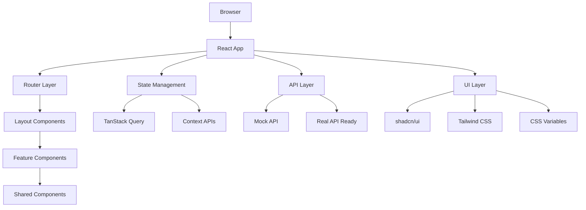

# myCistern IoT Device Management

React + TypeScript web app for managing IoT devices with real-time monitoring.

## Features

- Device dashboard with search and filtering
- Real-time metrics and status monitoring  
- Device command interface
- Dark/light theme with German/English support
- Mobile-responsive design
- Mock API for development

## Tech Stack

- React 18 + TypeScript + Vite
- TanStack Query for data fetching
- Tailwind CSS + shadcn/ui components
- React Router for navigation
- i18next for translations

## 📁 Project Structure

```
src/
├── api/
│   ├── client.ts                    # Unified API client with mock/real switching
│   └── mockApi.ts                   # Mock data and API responses
├── app/
│   ├── AppLayout.tsx               # Main layout with navigation & footer
│   ├── AppLayout.css
│   ├── Home.tsx                    # Landing page with hero & features
│   └── Home.css
├── components/ui/                   # shadcn/ui component library
│   ├── button.tsx                  # Button component with variants
│   ├── card.tsx                    # Card layout components
│   ├── badge.tsx                   # Status badges
│   ├── input.tsx                   # Form input components
│   ├── switch.tsx                  # Toggle switches
│   └── toast.tsx                   # Toast notification system
├── context/
│   └── ThemeContext.tsx            # Theme and language management
├── features/
│   └── devices/
│       ├── DeviceList.tsx          # Device grid with search & filters
│       ├── DeviceList.css
│       ├── DeviceDetail.tsx        # Detailed device dashboard
│       └── DeviceDetail.css
├── hooks/
│   ├── useCookieConsent.ts        # Cookie consent management
│   └── use-toast.ts               # Toast notification hook
├── i18n/
│   └── config.ts                  # Internationalization configuration
├── pages/
│   └── CookiePolicy.tsx           # GDPR cookie policy page
├── shared/
│   └── components/
│       ├── CookieBanner.tsx       # GDPR cookie consent banner
│       ├── CookiePreferences.tsx  # Cookie preferences modal
│       ├── ThemeToggle.tsx        # Theme & language toggle buttons
│       ├── LoadingSpinner.tsx     # Loading state component
│       └── ErrorDisplay.tsx       # Error state component
├── App.tsx                        # Router setup with providers
├── main.tsx                       # Application entry point
├── globals.css                    # Global styles and CSS variables
└── vite-env.d.ts                 # TypeScript declarations
```

## 🚀 Getting Started

### Prerequisites

- **Node.js** (v18 or higher) - [Download here](https://nodejs.org/)
- **pnpm** (recommended) - Install with `npm install -g pnpm`
- Modern web browser with JavaScript enabled

### Quick Start

1. **Clone the repository**
   ```bash
   git clone https://github.com/GaneshMandakapu/myCistern-TrialWorkday.git
   cd myCistern-TrialWorkday
   ```

2. **Install dependencies**
   ```bash
   pnpm install
   ```

3. **Start development server**
   ```bash
   pnpm dev
   ```

4. **Open your browser**
   - Navigate to `http://localhost:5173` (or `http://localhost:5174` if 5173 is in use)
   - The application will automatically reload when you make changes

### Available Scripts

```bash
pnpm dev          # Start development server with HMR
pnpm build        # Build for production
pnpm preview      # Preview production build locally
pnpm lint         # Run ESLint
pnpm type-check   # Run TypeScript compiler check
```

### Application Routes

| Route | Description | Features |
|-------|-------------|----------|
| `/` | **Home Page** | Hero section, features overview, team site link |
| `/devices` | **Device List** | Search, filter, device grid with status |
| `/devices/:id` | **Device Detail** | Live metrics, device control, status monitoring |
| `/cookies` | **Cookie Policy** | GDPR compliance information |

## 🏗️ Architecture Overview

### Frontend Architecture

The application follows a **feature-based modular architecture** with clear separation of concerns:



### Key Design Patterns

1. **Container/Presentational Pattern** - Smart containers handle logic, dumb components handle UI
2. **Custom Hooks Pattern** - Reusable logic in hooks (useDevices, useCookieConsent, etc.)
3. **Compound Component Pattern** - Complex UI components built from smaller, focused components
4. **Provider Pattern** - Context providers for global state (theme, language, query client)
5. **Error Boundary Pattern** - Graceful error handling with fallback UI

### Data Flow

```
User Interaction → Component → Custom Hook → TanStack Query → API Client → Mock/Real API
                                     ↓
User Interface ← Component ← State Update ← Cache Update ← API Response
```

## 🔧 Configuration & Environment

### Environment Variables

The app supports environment-based configuration via `.env` files:

```bash
# API Configuration
VITE_USE_MOCK_API=true              # Toggle between mock and real API
VITE_API_BASE_URL=http://localhost:3001  # Real API base URL (when implemented)

# Feature Flags
VITE_ENABLE_VOICE_SEARCH=true      # Enable/disable voice search feature
VITE_POLLING_INTERVAL=5000         # Metrics polling interval (ms)
```

### Build Configuration

- **Vite** for fast development and optimized production builds
- **TypeScript** for type safety and better developer experience
- **PostCSS** with Tailwind CSS for styling
- **ESLint + Prettier** for code quality and formatting

## Quick Start

```bash
git clone <repo-url>
cd myCistern-TrialWorkday
pnpm install
pnpm dev
```

Open http://localhost:5173

## Scripts

- `pnpm dev` - Start development server
- `pnpm build` - Build for production  
- `pnpm lint` - Run ESLint

## Assumptions

- Modern browsers (Chrome 80+, Firefox 72+, Safari 13+)
- Device status: online/offline/unknown
- Metrics in standard units (°C, %, hPa)
- Single user, no authentication required
- 5-second polling for updates
- Mock Service Worker handles API simulation

## Limitations

- Uses Mock Service Worker (MSW) for API simulation only
- No user authentication
- No data persistence between sessions
- Polling-based updates (no WebSockets)
- Performance may degrade with 1000+ devices

## 📊 API Documentation

All API functions are available in `src/api/client.ts`:

### Device Management
- `getDevices(query?, page?)` - Get all devices with optional search and pagination
- `getDeviceDetails(deviceId)` - Get detailed information for a specific device  
- `getDeviceMetrics(deviceId)` - Get metrics/telemetry data for a device
- `postDeviceCommand(command)` - Send a command to a device

